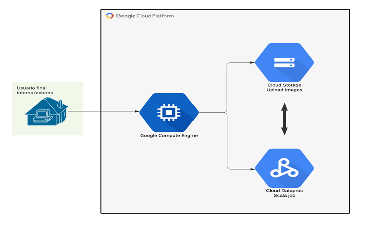

# Distributed Image Processing in Cloud Dataproc
This project is based on the [Distributed Image Processing in Cloud Dataproc](https://www.qwiklabs.com/focuses/5834?catalog_rank=%7B%22rank%22%3A8%2C%22num_filters%22%3A0%2C%22has_search%22%3Atrue%7D&parent=catalog&search_id=9364283) qwiklab from Google Cloud Self-paced labs.

In summary, the VM instance manages the interaction with the storage buckets to upload images, submits scala jobs and retrieve outlined faces that are also stored in the cloud storage bucket.

## Overview
This repo shows how to implement an Apache Spark cluster with Cloud Dataproc service, with the goal of distributing a computationally intensive image processing task onto a cluster of machines. Google cloud services used in this demo are:

- Virtual machine (VM): Development machine to host services. I have used an ssh connection to log from my local (ubuntu) to this VM through the following command:

`gcloud compute ssh --zone "us-central1-a" "devhost" --project "cloud-dataproc-project3"`

 where devhost is the name of the GCP VM instance that host services.

- Cloud storage buckets: to upload and collect the results (output)
- Cloud dataproc cluster: setting a region (i.e. us-central1) to create a new cluster

### Dataflow diagram

### Image processing example
Input image             |  Output image
:-------------------------:|:-------------------------:
  |  

## Prerequisites

- Review that your project is linked to an active, valid Cloud Billing account. You will not be able to use the products and services enabled in your project. This is true even if your project only uses Google Cloud services that are free.
- Confirm that the default compute Service Account {project-number}-compute@developer.gserviceaccount.com is present and has the editor role assigned.

Replace `{project-number}` with your project number.
For **Role**, select **Project (or Basic)** > **Editor**. Click **Save**.

## Guide to deploy the services (vm, cloud storage and cloud dataproc cluster)

1. Create a development machine in Compute Engine  
  1. **Compute Engine** > **VM Instances** > **Create**  
  2. Use the following parameters, as detailed in the referenced [qwiklab]((https://www.qwiklabs.com/focuses/5834?catalog_rank=%7B%22rank%22%3A8%2C%22num_filters%22%3A0%2C%22has_search%22%3Atrue%7D&parent=catalog&search_id=9364283)    
      * Name: devhost  
      * Series: N1  
      * Machine Type: 2 vCPUs (n1-standard-2 instance)  
      * Identity and API Access: Allow full access to all Cloud APIs.  

Click **Create**. This will serve as your development host.  

2. Install software (sbt and scala) to submit jobs to the cluster  

  a. `sudo apt-get install -y dirmngr unzip`  
  b. `sudo apt-get update`  
  c. `sudo apt-get install -y apt-transport-https`  
  d. `echo "deb https://dl.bintray.com/sbt/debian /" | \
       sudo tee -a /etc/apt/sources.list.d/sbt.list`  
  e. `sudo apt-key adv --keyserver hkp://keyserver.ubuntu.com:80 recv 642AC823`  
  f. `sudo apt-get update`  
  g. `sudo apt-get install -y bc scala sbt`  

3. Download the feature detector files and build the JAR

  1. `sudo apt-get update`
  2. `gsutil cp gs://spls/gsp124/cloud-dataproc.zip .
     unzip cloud-dataproc.zip`
  3. `cd cloud-dataproc/codelabs/opencv-haarcascade`

4. Launch the build

  1. `sbt assembly`

5. Create a cloud Storage bucket

  1. `GCP_PROJECT=$(gcloud config get-value core/project)`
  1. `MYBUCKET="${USER//google}-image-${RANDOM}"`
  1. `echo MYBUCKET=${MYBUCKET}`
  1. `gsutil mb gs://${MYBUCKET}`

6. Download images and upload them into the GCP Bucket

  1. This is only an example:  
    `curl https://www.publicdomainpictures.net/pictures/10000/velka/296-1246658839vCW7.jpg | gsutil cp - gs://${MYBUCKET}/imgs/classroom.jpg`
  1. Check buckets content:  
    `gsutil ls -R gs://${MYBUCKET}`

7. Create a Cloud Dataproc cluster

  1. `MYCLUSTER="${USER/_/-}-qwiklab"`
  1. `echo MYCLUSTER=${MYCLUSTER}`
  1. Set a global Compute Engine region to use and create a new cluster:  
    - `gcloud config set dataproc/region us-central1`
    - `gcloud dataproc clusters create ${MYCLUSTER} --bucket=${MYBUCKET} --worker-machine-type=n1-standard-2 --master-machine-type=n1-standard-2 --initialization-actions=gs://spls/gsp010/install-libgtk.sh --image-version=2.0`  

8. Submit a job to Cloud dataproc  

  1. Load face detection configuration file:  
  `curl https://raw.githubusercontent.com/opencv/opencv/master/data/haarcascades/haarcascade_frontalface_default.xml | gsutil cp - gs://${MYBUCKET}/haarcascade_frontalface_default.xml`
  1. Set of images uploaded into the imgs directory in your Cloud Storage bucket as input to your Feature Detector:  
    - `cd ~/cloud-dataproc/codelabs/opencv-haarcascade`
    - `gcloud dataproc jobs submit spark \
    --cluster ${MYCLUSTER} \
    --jar target/scala-2.12/feature_detector-assembly-1.0.jar -- \
    gs://${MYBUCKET}/haarcascade_frontalface_default.xml \
    gs://${MYBUCKET}/imgs/ \
    gs://${MYBUCKET}/out/`

## Links to documentation

To Be Completed.
